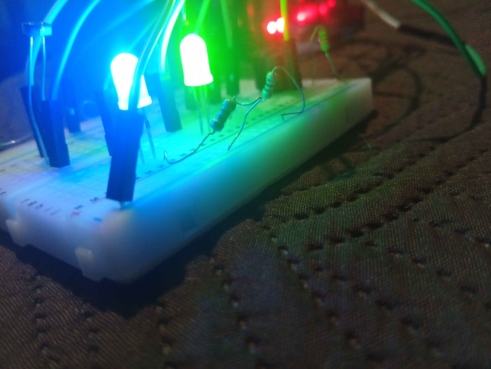
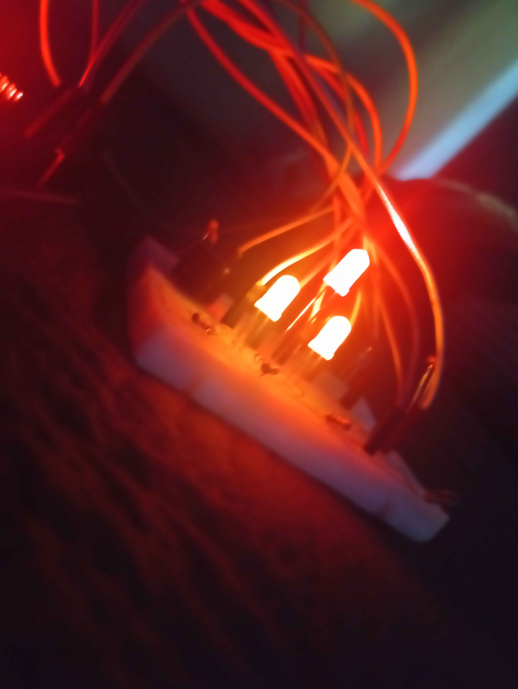

# 🌗 Sensor de Luminosidade com Arduino (Fade + Buzzer)

Projeto desenvolvido para detectar a luminosidade do ambiente e alternar automaticamente entre <br/>
**modo Dia** e **modo Noite**, utilizando LEDs com transição suave(fade) e feedback sonoro com buzzer.
<hr>

## 🎯 Objetivo

Criar um sistema simples de automação capaz de: 

- Detectar luz ambiente com um sensor LDR
- Alternar entre estados (Dia/Noite)
- Evitar oscilações rápidas (histerese)
- Realizar transições suaves entre estados (fade)
- Emitir sinais sonoros diferentes para cada modo
<hr>

## ⚙️ Funcionalidades
- 🌞 Modo Dia (LEDs frios ativos)
- 🌙 Modo Noite (LEDs quentes ativos)
- 🔄 Transição suave entre estados (fade com PWM)
- 🔊 Feedback com buzzer
- 🧠 Sistema com histerese para estabilidade
- 📊 Monitoramento via Serial
<hr>

## 🧠 Como funciona
O sistema lê continuamente o valor do sensor de luminosidade:

  - Se o valor for **baixo** (< 45) → ativa o **modo Noite**
  - Se o valor for **alto** (> 60) → ativa o **modo Dia**

Entre 45 e 60 o sistema **mantém o estado atual**, evitando mudanças rápidas (Isso é chamado de histerese).
<hr>

## 🔌 Componentes utilizados
- Arduino Uno
- Sensor LDR (fotoresistor)
- Resistores
- LEDs (azul, verde, amarelo, vermelho)
- Buzzer
- Protoboard + jumpers
<hr>

## 🔧 Conceitos aplicados
- Leitura analógica (analogRead)
- Controle PWM (analogWrite)
- Estrutura condicional (if)
- Organização em funções
- Histerese (evita flicker)
- Transições suaves (fade com loop)
  <hr>

## 📊 Exemplo de saída no Serial
```cpp
Valor: 72
Sensor: Dia
Sistema: Noite
```
> O sensor indica luz, mas o sistema não mudou de estado devido à histerese
<hr>

## 📸 Demonstração
### 🌞 Modo Dia
   <br>
  ### 🌙 Modo Noite
  

  Em breve: Video 
  <hr>

## 🚀 Melhorias futuras
- Substituir `delay()` por `millis()` (execução não bloqueante)
- Adicionar botão para controle manual
- Ajustar sensibilidade do sensor
- Melhorar padrão sonoro do buzzer
  <hr>
## 📌 Autor
Arthur Miguel
